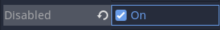

# Tutorial Game Development
## Authors

* **Rakan Fasya Athhar Rayyan** - *2106750950*

## Tutorial 2

- **Apa saja pesan log yang dicetak pada panel Output?**  
Pesan log yang dicetak adalah "Reached Objective".  

- **Coba gerakkan landasan ke batas area bawah, lalu gerakkan kembali ke atas hingga hampir menyentuh batas atas. Apa saja pesan log yang dicetak pada panel Output?**  
Pesan log yang dicetak adalah "Reached Objective" lagi karena BlueShip kembali menyentuh Objective Area yang men*trigger* script, tergantung berapa kali area *collision* BlueShip menyentuh area tersebut.  

- **Buka scene MainLevel dengan tampilan workspace 2D. Apakah lokasi scene ObjectiveArea memiliki kaitan dengan pesan log yang dicetak pada panel Output pada percobaan sebelumnya?**  
Ya, Lokasi scene ObjectiveArea berkaitan erat dengan pesan log yang dicetak karena terdapat script di dalamnya. Script ini mengecek apabila BlueShip (CollisionShape2D miliknya) berkolisi atau masuk ke dalam area kotak (CollisionShape 2D berbentuk kotak) atau tidak. Jika iya, maka akan memprint pesan log "Reached Objective". Apabila lokasi scene dirubah ke tempat yang tidak bisa diraih oleh BlueShip, maka pesan log tidak mungkin tercetak.   

- **Scene BlueShip dan StonePlatform sama-sama memiliki sebuah child node bertipe Sprite. Apa fungsi dari node bertipe Sprite?**  
Fungsi dari node Sprite adalah untuk menampilkan sebuah gambar atau *texture* yang berbentuk 2D atau dua dimensi. Pada tutorial ini, Node ini berfungsi untuk menampilkan Scene BlueShip dan StonePlatform supaya dalam game terlihat seperti kapal angkasa berwarna biru dan platform batu.

- **Root node dari scene BlueShip dan StonePlatform menggunakan tipe yang berbeda. BlueShip menggunakan tipe RigidBody2D, sedangkan StonePlatform menggunakan tipe StaticBody2D. Apa perbedaan dari masing-masing tipe node?**  
RigidBody2D merupakan Node yang terpengaruhi oleh *2D physics* pada suatu objek di sebuah game 2D, seperti gravitasi. Apabila kita menjauhkan StonePlatform dengan BlueShip (yang berada pada posisi atas) secara cepat, maka BlueShip akan turun karena terpengaruhi oleh gravitasi berkat diterapkannya RigidBody2D pada BlueShip. Sedangkan, StaticBody2D merupakan Node yang tidak terpengaruhi oleh *2D physics* sehingga biasanya ditujukan untuk objek-objek yang tidak bergerak, seperti tembok, *platform*, dll. Pada tutorial ini, StonePlatform bisa berjalan karena posisi Y objek dirubah langsung, bukan karena adanya *force* yang diaplikasikan ke StonePlatform. 

- **Ubah nilai atribut Mass dan Weight pada tipe RigidBody2D secara bebas di scene BlueShip, lalu coba jalankan scene MainLevel. Apa yang terjadi?**  
Berdasarkan eksplorasi yang telah saya lakukan, pada saat nilai Mass dan Weight diubah, tidak terjadi perubahan yang signifikan dimana tidak merubah kecepatan BlueShip turun akibat gravitasi.  

- **Ubah nilai atribut Disabled pada tipe CollisionShape2D di scene StonePlatform, lalu coba jalankan scene MainLevel. Apa yang terjadi?**  
Setelah nilai atribut Disabled diubah menjadi True, maka CollisionShape2D akan dinonaktifkan. Akibatnya, StonePlatform tidak akan berkolisi dengan BlueShip. Hal ini akan membuat BlueShip langsung jatuh tanpa ada yang berkolisi dengannya.  

- **Pada scene MainLevel, coba manipulasi atribut Position, Rotation, dan Scale milik node BlueShip secara bebas. Apa yang terjadi pada visualisasi BlueShip di Viewport?**  
Mengubah Position dari BlueShip pada MainLevel akan mengubah posisi awalnya pada sumbu X dan Y dalam Viewport.  

    Mengubah Rotation dari BlueShip pada MainLevel akan mengubah posisinya pada sumbu Z dalam Viewport.  
    

    Mengubah Scale dari BlueShip pada MainLevel akan mengubah ukuran dari BlueShip, menjadi lebih kecil atau besar.  
    
    
- **Pada scene MainLevel, perhatikan nilai atribut Position node PlatformBlue, StonePlatform, dan StonePlatform2. Mengapa nilai Position node StonePlatform dan StonePlatform2 tidak sesuai dengan posisinya di dalam scene (menurut Inspector) namun visualisasinya berada di posisi yang tepat?**  
Hal ini dikarenakan kedua StonePlatform berada merupakan child dari PlatformBlue. Oleh karena itu, child-child (StonePlatform dan StonePlatform2) dari PlatformBlue akan mengikuti posisi visualisasi dari parentnya yang merupakan posisi tepat dalam scene.

